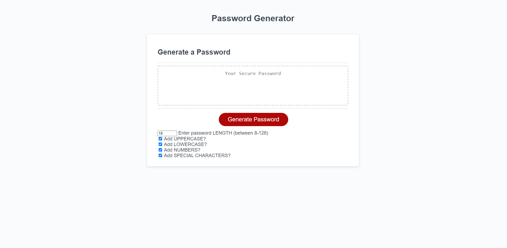

# password-generator
## 👨‍💻 Mission
Help users secure their login information with strong passwords from my password generator.

## 🌐 Application
<a href="https://pr1me-e1gh7.github.io/password-generator/">Link to the App</a>

## 💻 User Experience
When user's load the page they'll see the password generator, equipped with checkboxes that'll determine elements used in the generated password, and a box to enter in the desired length. Users must use at least 8 characters and at most 128 characters in the password they generate. The elements they may include in their password are lowercase letters, uppercase letters, numbers, and special characters. When the user clicks on the generate password button, the password will be created.
## 🏁 Challenge Criteria
```md
GIVEN I need a new, secure password
WHEN I click the button to generate a password
THEN I am presented with a series of prompts for password criteria
WHEN prompted for password criteria
THEN I select which criteria to include in the password
WHEN prompted for the length of the password
THEN I choose a length of at least 8 characters and no more than 128 characters
WHEN asked for character types to include in the password
THEN I confirm whether or not to include lowercase, uppercase, numeric, and/or special characters
WHEN I answer each prompt
THEN my input should be validated and at least one character type should be selected
WHEN all prompts are answered
THEN a password is generated that matches the selected criteria
WHEN the password is generated
THEN the password is either displayed in an alert or written to the page
```
## 🎨 Preview
